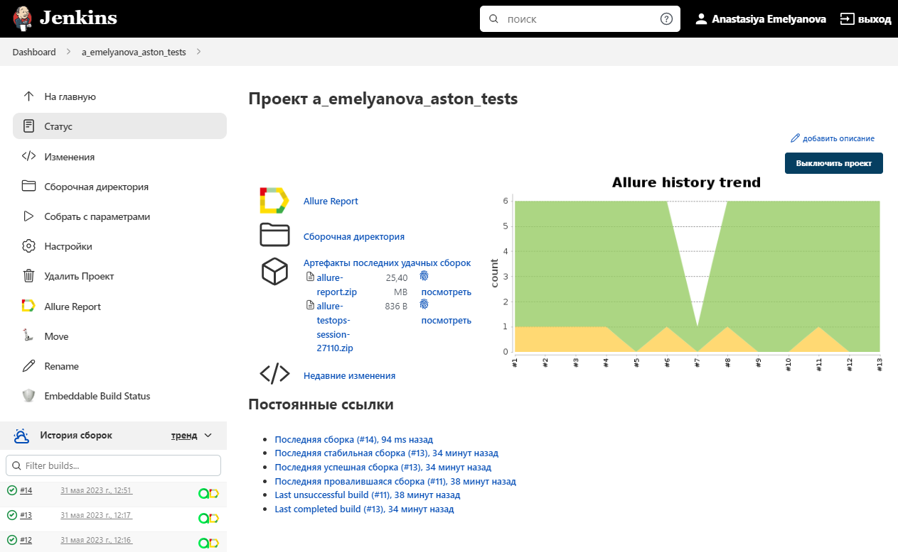
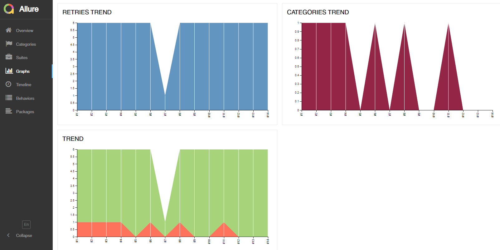

# Проект по автоматизации тестирования для компании [Aston](https://astondevs.ru/)

 


> Компания Aston представлена на российском рынке с 2007 года, предоставляя услуги разработки программного обеспечения и IT-аутсорса предприятиям, организациям и стартапам.

## **Содержание:**
____
- Технологии и инструменты
- Примеры автоматизированных тест-кейсов
- Примеры ручных тест-кейсов
- Запуск из терминала
- Cборка в Jenkins

- Allure отчет
- Интеграция с Allure TestOps
- Интеграция с Jira
- Уведомление в Telegram при помощи бота
- Примеры видео выполнения тестов на Selenoid

<a id="tools"></a>
## Технологии и инструменты:
____

| Java                                                                                                      | IntelliJ  <br>  Idea                                                                                               | GitHub                                                                                                     | JUnit 5                                                                                                           | Gradle                                                                                                     | Selenide                                                                                                         | Selenoid                                                                                                                  | Allure <br> Report                                                                                                         |  Jenkins                                                                                                        |   Jira                                                                                                                                  | Allure <br> TestOps                                                                                            | Telegram                                                                                                    
|:----------------------------------------------------------------------------------------------------------|--------------------------------------------------------------------------------------------------------------------|------------------------------------------------------------------------------------------------------------|-------------------------------------------------------------------------------------------------------------------|------------------------------------------------------------------------------------------------------------|------------------------------------------------------------------------------------------------------------------|---------------------------------------------------------------------------------------------------------------------------|----------------------------------------------------------------------------------------------------------------------------|-----------------------------------------------------------------------------------------------------------------|-----------------------------------------------------------------------------------------------------------------------------------------|----------------------------------------------------------------------------------------------------------------|-------------------------------------------------------------------------------------------------------------------:|
| <a href="https://www.java.com/"></a>  | <a href="https://www.jetbrains.com/idea/"></a> | <a href="https://github.com/"></a> | <a href="https://junit.org/junit5/"></a> | <a href="https://gradle.org/"></a> | <a href="https://selenide.org/"></a> | <a href="https://aerokube.com/selenoid/"></a> | <a href="https://github.com/allure-framework"></a> |<a href="https://www.jenkins.io/"></a> | <a href="https://www.atlassian.com/software/jira/"></a> | <a href="https://qameta.io/"></a> | <a href="https://web.telegram.org/"></a>

- В данном проекте автотесты написаны на языке <code>Java</code> с использованием фреймворка для тестирования <code>Selenide</code>
- В качестве сборщика был использован - <code>Gradle</code>
- Использованы фреймворки <code>JUnit 5</code> и <code>Selenide</code>
- При прогоне тестов браузер запускается в <code>Selenoid</code>
- Для удаленного запуска реализована джоба в <code>Jenkins</code> с формированием <code>Allure-отчета</code> и отправкой результатов в <code>Telegram</code> при помощи бота.
- Осуществлена интеграция с <code>Allure TestOps</code> и <code>Jira</code>

## <a name="Примеры автоматизированных тест-кейсов">**Примеры автоматизированных тест-кейсов:**</a>
____
- ✓ *Параметризованный тест. При выборе города отображается корректный адрес на карте*
- ✓ *Заполнение формы 'Запросить оценку стоимости выделенной команды'*
- ✓ *Доступность вкладки 'QA аудит' из раздела 'Контроль качества ПО'*
- ✓ *Поиск несуществующего текста в разделе 'Стажировка в Aston'*
- ✓ *Проверка заголовка страницы при выборе стека 'Java' в разделе 'Технологии'*

____
## <a name="Примеры ручных тест-кейсов">**Примеры ручных тест-кейсов:**</a>
____
- ✓ *После заполнения формы "Рассчитать стоимость проекта" открывается окно для ввода данных*
- ✓ *Заполнение формы "Получите коммерческое предложение для вашего ИТ-решения"*
- ✓ *По кнопке 'Вакансии' в разделе 'Карьера в Aston' осуществляется переход на сайт hh.ru*
- ✓ *При нажатии на "Облачная разработка" открывается страница с заголовком "Услуги по разработке"*
- ✓ *При нажатии на город "Санкт-Петербург", отображается корректный адрес на карте*
____
## <a name="Команды для запуска из терминала">**Команды для запуска из терминала:**</a>

___
***Локальный запуск:***
```bash  
gradle clean aston_test
```

***Удалённый запуск через Jenkins:***
```bash  
clean aston_test
-Dbrowser=${BROWSER}"
-DbrowserVersion=${BROWSER_VERSION}"
-DbrowserSize=${BROWSER_SIZE}"
-DbaseUrl=${BASE_URL}}"
-Dremote=${REMOTE}"
```

## </a><a name="Сборка"></a>Сборка в [Jenkins](https://jenkins.autotests.cloud/job/aemelyanova_aston_test/)</a>
____
<p align="center">  
<a href="https://jenkins.autotests.cloud/job/a_emelyanova_aston_tests/"></a>  
</p>


#### Параметры сборки

* <code>BROWSER</code> – браузер, в котором будут выполняться тесты. По-умолчанию - <code>chrome</code>
* <code>BROWSER_VERSION</code> – версия браузера, в которой будут выполняться тесты. По-умолчанию - <code>100.0</code>
* <code>BROWSER_SIZE</code> – размер окна браузера, в котором будут выполняться тесты. По-умолчанию - <code>"1980x1080"</code>
* <code>BASE_URL</code> – Url, по которому будет открываться тестируемое приложение. По-умолчанию - <code>https://astondevs.ru</code>.
* <code>REMOTE_BROWSER_URL</code> – адрес удаленного сервера, на котором будут запускаться тесты.

## </a> <a name="Allure"></a>Allure [отчет](https://jenkins.autotests.cloud/job/aemelyanova_aston_test/18/allure/)</a>
___

### *Основная страница отчёта*

<p align="center">  
  
</p>  

### *Тест-кейсы*

<p align="center">  
  
</p>

### *Графики*

  <p align="center">  
  
  
</p>

___

## </a> Интеграция с <a target="_blank" href="https://allure.autotests.cloud/project/2489/dashboards">Allure TestOps</a>
____
### *Allure TestOps Dashboard*

<p align="center">  
  
</p>  

### *Ручные тест-кейсы*

<p align="center">  
  
</p>

### *Авто тест-кейсы*

<p align="center">  
  
</p>

___